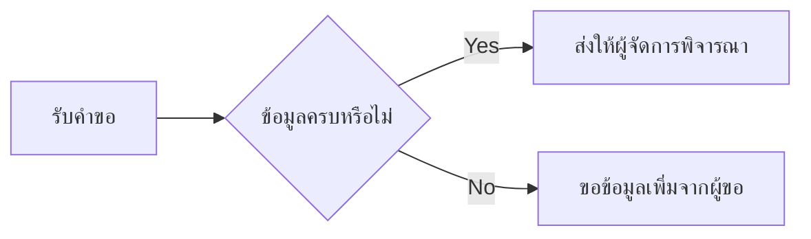

# Exercise 4: ร่าง Workflow ที่คนและระบบทำงานร่วมกัน

<CourseProgress :current="4" />

เหมือนเขียนสูตรอาหารให้คนอื่นทำตาม Blueprint ต้องบอกจุดเริ่ม ลำดับงาน และสิ่งที่ทำเมื่อเงื่อนไขไม่เป็นไปตามคาด

**เวลา:** 14:10–14:25 และ 14:45–15:30 รวม 60 นาที

> **License:** กิจกรรมบนกระดาษนี้ไม่ต้องใช้ paid software licence หรือบัญชี Power Automate ผู้เรียนไม่ต้องสร้าง Flow

## เตรียมก่อนเริ่ม

- ทำงานกลุ่มละ 4–6 คน หรือปรับตามจำนวนคนในห้อง
- เตรียม post-it ปากกา และกระดาษแผ่นใหญ่ แบ่งหน้าที่ผู้จด ผู้จับเวลา และผู้นำเสนอ
- ใช้ [ชุดสถานการณ์สมมติ](/resources/case-pack) และ [แบบบันทึก](/resources/worksheets)
- ใช้โอกาสที่เลือกจาก Exercise 3 หากไม่มีให้เลือกการส่งคำขอจัดอบรมที่ข้อมูลครบไปให้ผู้จัดการ

## Practice 1: กำหนด Trigger และผลลัพธ์ (15 นาที) {#practice-1}

เป้าหมาย: ระบุจุดเริ่มและจุดจบของ workflow ที่เลือก

1. เขียนประโยค “เมื่อ...เกิดขึ้น เราต้องการให้...เพื่อ...” โดยใช้เหตุการณ์ที่สังเกตได้
2. วงเหตุการณ์เริ่มต้นเป็น Trigger เช่น มีคำขอใหม่ในช่องทางที่ตกลงไว้
3. ระบุข้อมูลที่ต้องมีตอนเริ่มและผลลัพธ์ที่ทำให้รู้ว่างานจบ
4. กรอกส่วนหัวแบบบันทึก 4 และให้คนในกลุ่มเล่ากลับด้วยคำของตนเอง
5. เก็บภาพตั้งต้นไว้ต่อหลังพัก โดยยังไม่เลือกชื่อ Connector ที่ไม่ยืนยัน

### Checkpoint

มี Trigger หนึ่งเหตุการณ์และผลลัพธ์ปลายทางที่ตรวจได้

## Practice 2: ร่างขั้นตอนและบทบาท (25 นาที) {#practice-2}

เป้าหมาย: สร้าง blueprint ที่ระบุเส้นทางงานและผู้รับผิดชอบ

1. วาง 5–8 ขั้นตอนตั้งแต่ Trigger ถึงผลลัพธ์ ใช้ post-it หนึ่งการกระทำต่อหนึ่งใบ
2. กำกับแต่ละขั้นตอนว่าเสนอให้ระบบทำตามกติกาหรือให้คนทำ
3. ใส่ Condition หนึ่งจุดเป็นคำถาม Yes/No เช่น ข้อมูลที่จำเป็นครบหรือไม่ และวาดให้ครบทั้งสองทาง
4. ระบุจุดพิจารณาของคน เช่น ผู้จัดการอนุมัติ พร้อมเส้นทางเมื่อไม่อนุมัติ
5. เขียนผู้รับผิดชอบเมื่อข้อมูลขาดหรืองานค้าง และช่องทางที่ต้องตรวจความเป็นไปได้
6. คัดสาระลงแบบบันทึก 4 และตัดขั้นตอนที่ซ้ำโดยไม่ทำให้การตรวจหายไป

### Checkpoint

ภาพมีบทบาททุกขั้นตอน มี Yes/No ครบ และมีคนรับผิดชอบกรณีผิดปกติ

## Practice 3: เดินทดสอบบนกระดาษ (20 นาที) {#practice-3}

เป้าหมาย: ตรวจความชัดเจนของ blueprint ด้วยกรณีปกติและข้อยกเว้น

1. เลือก R-101 และ R-102 หรือ R-103 จาก case pack หากใช้เรื่องอื่นให้สร้างข้อมูลสมมติที่เทียบกันได้
2. เขียนผลที่คาดหวังของแต่ละกรณีก่อนเริ่มเดินภาพ
3. ให้คนหนึ่งเล่นเป็นผู้ขอ อีกคนเป็นผู้จัดการ และอีกคนอ่านขั้นตอนที่ระบบจะทำ ห้ามข้ามขั้นตอนที่ไม่ได้เขียน
4. จดจุดที่ไปต่อไม่ได้ เช่น ไม่มีข้อมูลหรือไม่มีผู้รับผิดชอบ ในแบบบันทึก 5
5. แก้ภาพแล้วเดินกรณีเดิมอีกครั้ง บันทึกผลและเรื่องที่ยังต้องถามผู้ดูแลระบบ

### Checkpoint

มีผลทดสอบ 2 กรณี มีการตรวจเส้นทางข้อยกเว้น และแยกความชัดของภาพออกจากการยืนยันระบบจริง

## ตัวอย่างการแยกเส้นทางเชิงแนวคิด

ตัวอย่างนี้แสดงเฉพาะการตรวจความครบถ้วน กลุ่มยังต้องเติมผลอนุมัติ/ไม่อนุมัติและการแจ้งผลใน blueprint ของตนเอง

## เมื่อพบอุปสรรค

หากยังไม่มีตัวอย่างงานที่เหมาะสม ให้ใช้กรณีคำขอจัดอบรมภายใน หากไม่ทราบกติกาหรือสิทธิ์ ให้เขียนว่า “ต้องตรวจสอบ” พร้อมชื่อบทบาทที่จะถาม อย่าเติมคำตอบแทนเจ้าของงาน

## สรุป

เราได้แบบร่างที่เพื่อนเดินตามได้ แต่ยังไม่ใช่ Flow ที่ทดสอบในสภาพแวดล้อมจริง ต่อไปสรุปสิ่งที่ต้องส่งต่อให้ทีมใน Exercise 5

<ExerciseFooter prev="/exercises/03-prioritize-opportunity" next="/exercises/05-leadership-handover" prev-label="Exercise 3" next-label="Exercise 5" />
