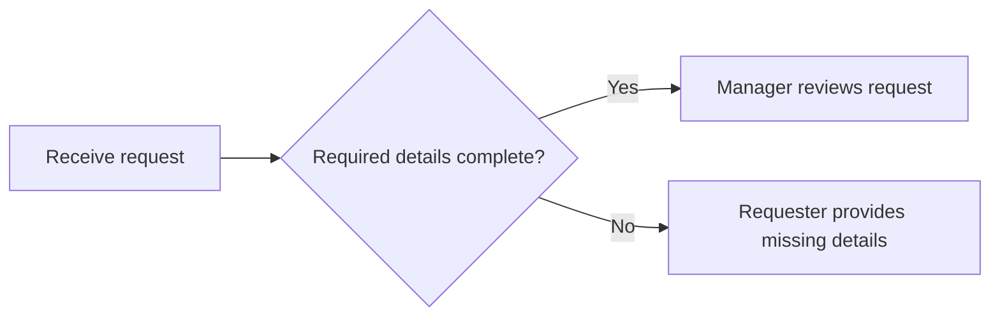

# Exercise 4: Design with physical Flow cards

<ExerciseModuleHeader :module="3" />

<CourseProgress :current="4" />

Arrange a recipe on the table before entering the kitchen. Use the facilitator's printed Flow cards to show the proposed sequence, then add sticky notes for people, exceptions, and unresolved questions.

**Time:** 13:40–14:30

> **Licence:** No Power Automate account or paid Power Automate licence is required for this paper activity. The facilitator distributes the physical cards separately; their source files are excluded from this digital package.

## Preparation

- Work in groups of 4–6 with one physical card deck, large paper, sticky notes, and pens.
- Open the [case pack](/resources/case-pack) and [worksheets](/resources/worksheets).
- Bring the opportunity selected in Exercise 3. If necessary, use the internal training-request case.
- Begin only after the explanation of Trigger, Action, and Condition. Use fictional or sanitised information only.

> **Card correction:** The supplied `Start and wait for an approval` card is printed as a Trigger. In Power Automate it is an **Action** and belongs after a valid Trigger. Explain this distinction without changing the original card.

## Practice 1: Build the normal path (15 minutes) {#practice-1}

**Primary target:** Arrange a path from Trigger to outcome that another person can explain.

**Learner output:** A physical normal path and matching Worksheet 4 sequence.

::: tip Start your group challenge
Open the challenge assigned to your group. The scenario details are in Thai, while every Power Automate card name remains in English exactly as printed on the physical deck.

| Group | Dedicated challenge |
|---|---|
| 1 | [Open Group 1 challenge](/exercises/04-workflow-blueprint/group-1) |
| 2 | [Open Group 2 challenge](/exercises/04-workflow-blueprint/group-2) |
| 3 | [Open Group 3 challenge](/exercises/04-workflow-blueprint/group-3) |
| 4 | [Open Group 4 challenge](/exercises/04-workflow-blueprint/group-4) |
| 5 | [Open Group 5 challenge](/exercises/04-workflow-blueprint/group-5) |
| 6 | [Open Group 6 challenge](/exercises/04-workflow-blueprint/group-6) |
:::

1. Read the selected opportunity. Complete “When ... happens, we want ... so that ...” in Worksheet 4.
2. Choose one Trigger card matching the start event. Add **Needs verification** if connector availability is unknown.
3. Select cards for the main steps and arrange them left to right.
4. Use sticky notes for missing or repeated steps. Do not add a step simply because the deck contains a card for it.
5. Add an outcome sticky note. Ask someone else to describe the path from Trigger to outcome.
6. Record the sequence in Worksheet 4 and leave the cards in place during the break.

### Checkpoint

A participant who did not arrange the cards can explain the Trigger, main steps, and normal outcome.

## Practice 2: Add owners and human checkpoints (8 minutes) {#practice-2}

**Primary target:** Assign responsibility and make human judgement visible at the relevant steps.

**Learner output:** An owner for every visible step and named human checkpoints in Worksheet 4.

1. Revisit the normal path. Remove unnecessary duplication without removing checks.
2. Add a sticky note naming the person or system responsible for every step.
3. Mark human review and business decisions, such as the manager deciding whether to approve or reject a request.
4. Record the owners and human checkpoints in Worksheet 4.

### Checkpoint

Every visible step has an owner, and each business decision names the person who makes it.

## Practice 3: Add branches and exception routes (12 minutes) {#practice-3}

**Primary target:** Represent justified branches and give every exception route a responsible owner.

**Learner output:** Visible normal and exception routes for missing information, rejection, and stalled work.

1. For the fictional training-request case, add a completeness Condition as a Yes/No question and show both routes. For another process, add a Condition only when an agreed rule genuinely creates branches.
2. Show both approval and rejection outcomes after the human decision. Both routes must reach a notification or an owned follow-up.
3. Add separate routes for missing information and stalled work. Name the responsible role and where work resumes or escalates.
4. Mark unconfirmed connectors, permissions, policies, information, owners, or timing **Needs verification**.
5. Update the branches and exception routes in Worksheet 4 and the exception section of Worksheet 6C.

### Checkpoint

Every branch has visible outcomes, and missing-information, rejection, and stalled-work routes each have an owner.

## Practice 4: Walk-test two cases (15 minutes) {#practice-4}

**Primary target:** Find and repair gaps by walking a normal and an exception case through the visible design.

**Learner output:** A Worksheet 5 test record covering one normal case and one exception case.

1. Use R-101 for the normal case and R-102 or R-103 for the exception case. For another process, create equivalent fictional inputs.
2. Record each expected outcome in Worksheet 5 before testing.
3. Assign requester, decision-maker, and step-reader roles. Follow only steps represented by cards or sticky notes.
4. Stop when the path gets stuck. Do not invent an unrecorded step aloud.
5. Record the gap and its impact, then change the cards or sticky notes.
6. Repeat the affected path. Record whether it passes or who must resolve the remaining question.

### Checkpoint

Both cases reach a clear outcome or an escalation point with a named owner. You can explain why this paper test does not establish tenant feasibility.

## Conceptual branch example

This example covers completeness only. Your group must also represent approval, rejection, notification, and any agreed return or escalation route.

## If you get stuck

- Use sticky notes for missing cards or repeated Actions. Flag the product term for verification if necessary.
- Record unknown rules and permissions with the role to ask; do not invent them.
- If the design becomes too large, return to the start and outcome agreed in Exercise 3.

## Summary

Keep the tested physical Blueprint and test record. In Exercise 5, describe the design in safe text and ask Copilot Chat to challenge its assumptions.

## Official references

- [Triggers](https://learn.microsoft.com/en-us/power-automate/triggers-introduction)
- [Conditions in cloud flows](https://learn.microsoft.com/en-us/power-automate/add-condition)
- [Approval actions](https://learn.microsoft.com/en-us/power-automate/get-started-approvals)

[Course home](/) · [Previous exercise](/exercises/03-prioritize-opportunity) · [Next exercise](/exercises/05-leadership-handover)

<ExerciseFooter prev="/exercises/03-prioritize-opportunity" next="/exercises/05-leadership-handover" prev-label="Exercise 3" next-label="Exercise 5" />
